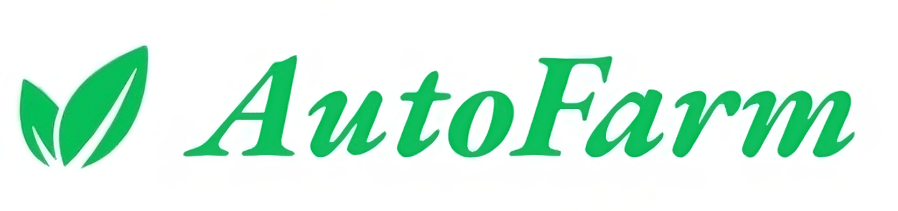
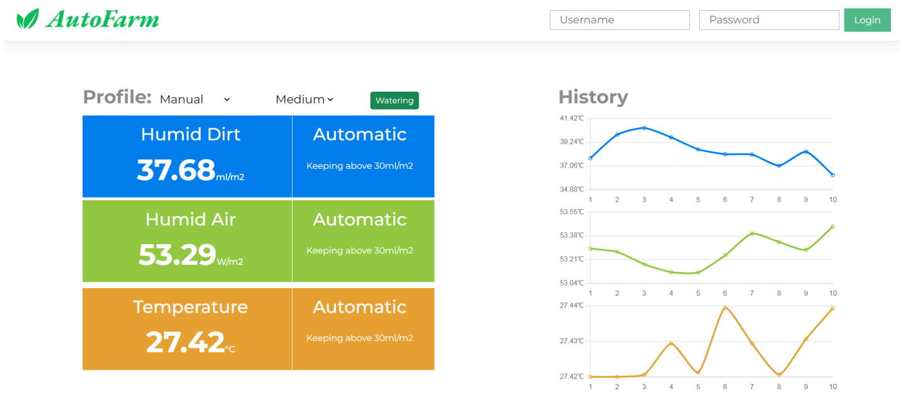

## AutoFarm 
Indoor plants and home gardening have gained popularity in recent years. But not everyone
has the time or knowledge to care for their plants properly. Smart plant care solutions can
help with it. These systems can monitor the circumstances of the plants and make adjustments
to ensure their optimum development and health by utilizing sensors and automation
technology.

In this project, we wanted to develop a smart plant care system that can be remotely
monitored and controlled, and that can access all of the system's data and conditions using a
web app.

## UI

Real-time Data and Short History Section: This section provides you with up-to-date
information and a brief history of your app's data.

Profile Section: In the Profile section, you have three profile options to choose from:
Manual, Auto, and Semi-Auto
